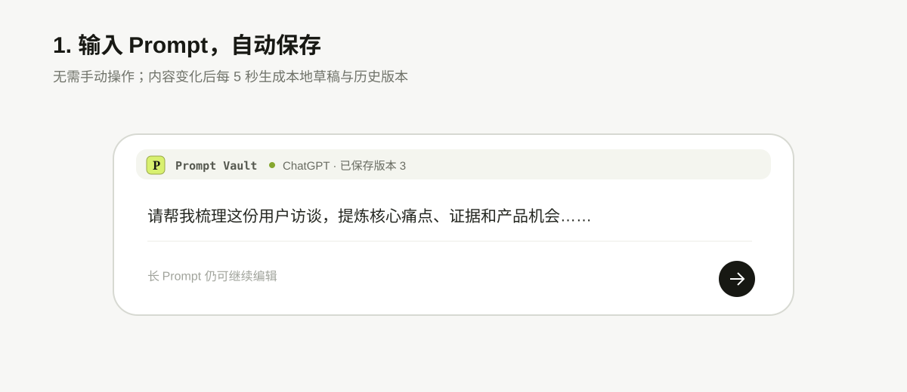
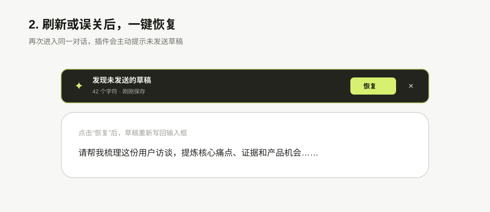
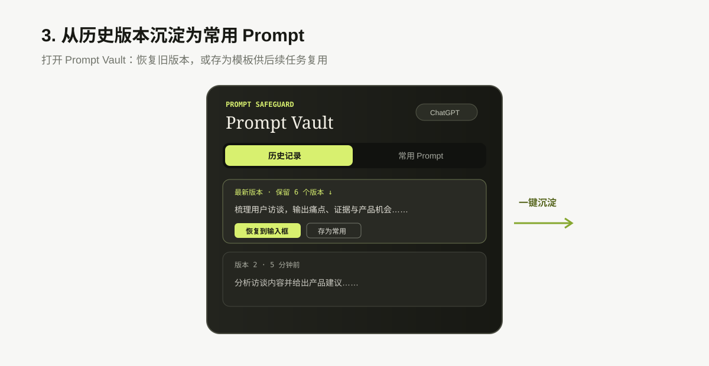

# Prompt Safeguard

本地优先的浏览器扩展：在 AI 聊天页面自动保护长 Prompt，并沉淀为可复用模板。

## Why

长 Prompt 在刷新、误关页面或站点重渲染后容易丢失。Prompt Safeguard 将这一真实使用痛点拆成两层：

- **即时保护**：每 5 秒自动保存草稿，意外返回时一键恢复；
- **长期复用**：保留版本历史，将高频 Prompt 整理为可搜索、可插入的模板。

## 产品逻辑

`保护 → 沉淀 → 复用`：先消除未发送内容丢失，再让多轮修改可回溯，最后把验证有效的 Prompt 变成可复用资产。

1. **保护**：仅在内容变化时将草稿写入浏览器本地；发送或清空后自动撤销待恢复草稿。
2. **沉淀**：以“站点 + 对话”为边界保存去重后的版本，避免不同任务之间互相污染。
3. **复用**：把历史版本存入 Prompt Vault，支持搜索、分类、变量填充和一键插回输入框。
4. **兼容**：精确适配主流 Chatbot；站点改版时依次回退到通用输入框评分与手动选框。扩展控件不插入原生输入区，避免影响页面布局。

## 如何使用

### 1. 输入 Prompt，等待自动保存

内容发生变化后，状态会显示已保存；无需手动点击保存。



### 2. 意外刷新后恢复草稿

重新进入同一对话，点击恢复提示，即可将未发送内容写回输入框。



### 3. 将有效版本沉淀为常用 Prompt

点击 `Prompt Vault` 查看历史版本，可恢复旧版本或存为模板，后续搜索并一键插入。



## 迭代

| 版本 | 关键决策 | 解决的问题 |
| --- | --- | --- |
| V1 | ChatGPT 草稿自动保存与恢复 | 验证“长 Prompt 意外丢失”这一核心痛点。 |
| V2 | 版本历史与 Prompt Vault | 从一次性救急延伸到 Prompt 资产复用。 |
| V3 | 多站点适配器 + 通用检测 + 手动选框 | 平衡跨站覆盖、识别准确率与后续维护成本。 |
| V3.1 | 固定层挂载与差异化停靠 | 根据真实页面布局问题调整交互：ChatGPT 保留输入框上方入口，其他高输入区网站采用右侧停靠。 |

## Features

- 草稿自动保存与恢复
- 版本历史（按站点与对话隔离）
- Prompt 模板库、搜索与变量填充
- ChatGPT、豆包、Gemini、Claude、DeepSeek 精确适配
- 其他聊天网站的通用检测与手动选框兜底

## Install

1. 下载或克隆本仓库。
2. 打开 `edge://extensions` 或 `chrome://extensions`，开启开发人员模式。
3. 点击“加载解压缩的扩展”，选择本项目目录。
4. 重新加载扩展后刷新聊天页面。

## Verify

```powershell
node --check content.js
node tests\core.test.js
node tests\adapters.test.js
node tests\manifest.test.js
node tests\content-layout.test.js
node tests\exact-adapter-contract.test.js
```

## Privacy

草稿、历史和模板只存储在 `chrome.storage.local`；项目不依赖后端，也不上传 Prompt 内容。

## License

[MIT](LICENSE)
