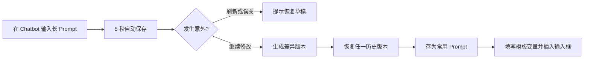
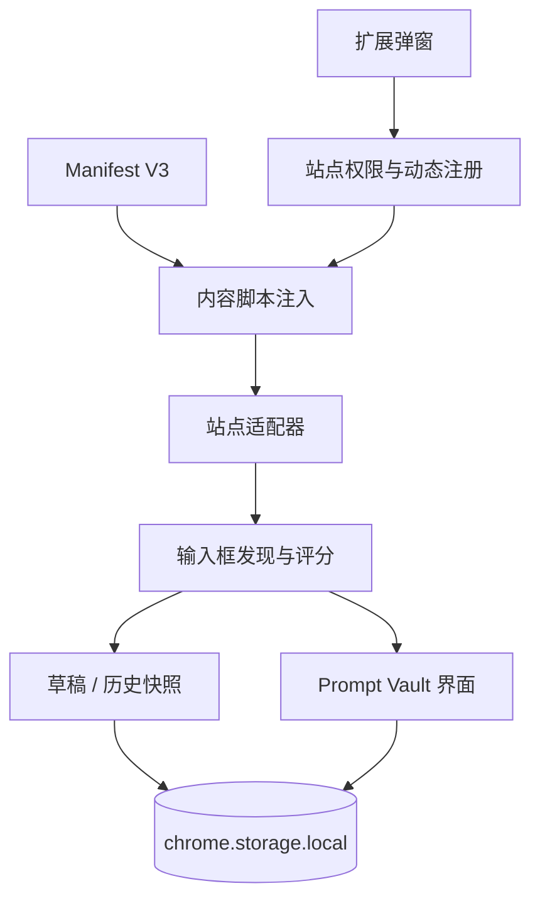

# Prompt Safeguard

> 面向重度 AI 对话用户的本地 Prompt 草稿保险箱：自动保存长 Prompt、保留版本历史，并把高频 Prompt 沉淀为可复用模板。


Prompt Safeguard 是一款 Edge / Chrome 浏览器扩展，解决长 Prompt 在刷新、误关页面或切换对话时丢失的问题。它把“临时草稿保护”和“长期 Prompt 资产管理”放在同一个聊天输入框旁完成，无需复制到第三方笔记工具。

## 30 秒看懂这个项目

| 用户痛点 | 产品方案 | 当前实现 |
| --- | --- | --- |
| 长 Prompt 未发送前刷新即丢失 | 每 5 秒检测变化并保存本地草稿 | 已实现 |
| 多轮修改后无法找回较早版本 | 每个对话保留最近 100 个差异版本 | 已实现 |
| 高频 Prompt 散落在聊天记录与笔记中 | Prompt 库、文件夹、搜索与一键插入 | 已实现 |
| 模板每次都要重复改变量 | 支持 `{{变量名}}` 占位符和填写表单 | 已实现 |
| 不同 Chatbot 的输入框结构不一致 | 站点适配器 + 通用评分检测 + 手动选框 | 已实现 |
| Prompt 可能包含敏感业务信息 | 全部数据仅存于 `chrome.storage.local` | 已实现 |

## 核心体验



- **草稿自动保护**：仅在内容发生变化时写入，输入框为空或消息发送后清除待恢复草稿。
- **版本历史**：按“站点 + 对话”隔离，每个对话最多保留最近 100 个版本。
- **Prompt Vault**：保存、编辑、删除、搜索常用 Prompt，并用文件夹组织。
- **变量模板**：识别 `{{产品名称}}` 等占位符，使用前生成变量填写表单。
- **多站点适配**：内置 ChatGPT、豆包、Gemini、Claude、DeepSeek，并为其他网站提供通用检测。
- **手动兜底**：网站改版导致自动识别不准时，可手动指定输入框并记住选择。

## 产品思考

这个项目不只是“自动保存输入框”。产品设计中有三个关键判断：

1. **恢复是低频刚需，沉淀才是长期价值**：从草稿恢复延伸到版本历史和 Prompt 库，让一次救急形成持续使用理由。
2. **跨站兼容不能只靠 CSS Selector**：采用“精确适配器 → 可见候选评分 → 手动指定”的三层策略，在识别准确率和维护成本之间取平衡。
3. **隐私优先于云同步**：MVP 不引入后端，避免 Prompt 离开浏览器；跨设备同步作为后续可选能力，而不是默认前提。

更完整的用户问题、产品目标、方案取舍、验收标准和路线图见 [产品案例文档](docs/PRODUCT_CASE.md)。

## 支持范围

| Chatbot | 域名 | 适配方式 |
| --- | --- | --- |
| ChatGPT | `chatgpt.com` | 精确适配 |
| 豆包 | `doubao.com` | 精确适配 |
| Gemini | `gemini.google.com` | 精确适配 |
| Claude | `claude.ai` | 精确适配 |
| DeepSeek | `chat.deepseek.com` | 精确适配 |
| 其他网页 Chatbot | HTTP / HTTPS | 通用检测 + 手动选框 |

## 安装

### Edge

1. 下载或克隆本仓库。
2. 打开 `edge://extensions`。
3. 开启右侧的“开发人员模式”。
4. 点击“加载解压缩的扩展”，选择仓库根目录。
5. 打开支持的 Chatbot 页面并刷新一次。

### Chrome

1. 下载或克隆本仓库。
2. 打开 `chrome://extensions`。
3. 开启“开发者模式”。
4. 点击“加载已解压的扩展程序”，选择仓库根目录。

从旧版本升级时，请在扩展卡片中点击“重新加载”，并刷新已经打开的 Chatbot 标签页。若浏览器提示新增站点权限，需要确认后扩展才会继续运行。

## 使用

### 恢复临时草稿

输入内容后等待状态变为“已安全保存”。刷新或重新打开当前对话时，输入框上方会出现恢复提示；点击“恢复”即可写回输入框。

### 保存常用 Prompt

打开输入框上方的 `Prompt Vault`，可以：

- 将某个历史版本存为常用 Prompt；
- 新建文件夹并分类；
- 搜索标题或正文；
- 编辑、删除或一键插入 Prompt。

模板示例：

```text
请为 {{产品名称}} 写一份面向 {{目标用户}} 的产品介绍，语气为 {{语气}}。
```

### 手动选择输入框

如果网站改版后标志没有出现：

1. 点击扩展图标；
2. 选择“重新选择输入框”；
3. 移动鼠标到聊天输入框并点击；
4. 插件会按站点保存该选择器。

## 技术方案



项目使用原生 JavaScript、CSS 和 Chrome Extension API，无构建步骤、无远程代码、无后端服务。

| 文件 | 职责 |
| --- | --- |
| `manifest.json` | Manifest V3、权限和注入配置 |
| `adapters.js` | 站点识别、输入框评分、对话作用域与挂载策略 |
| `content.js` | 自动保存、恢复、历史版本、Prompt Vault 和手动选框 |
| `core.js` | 纯函数：版本去重、模板变量、搜索和数据规范化 |
| `popup.js` | 站点授权、动态注入和入口控制 |
| `tests/` | 核心逻辑、适配器、清单与浏览器测试页 |

## 隐私与安全

- 草稿、历史、Prompt 库和站点选择器全部保存在本机 `chrome.storage.local`。
- 不包含远程脚本，不向开发者服务器上传 Prompt。
- 内置站点仅用于注入本地功能；其他网站需要用户主动授权。
- 卸载扩展会删除其本地存储，重要 Prompt 请提前自行备份。

## 开发与验证

环境要求：Node.js 18+。

```powershell
node --check core.js
node --check adapters.js
node tests\content-layout.test.js
node tests\exact-adapter-contract.test.js
node --check content.js
node --check popup.js
node tests\core.test.js
node tests\adapters.test.js
node tests\manifest.test.js
```

当前测试覆盖：

- 历史版本去重与最大保留数；
- 模板变量提取和填充；
- Prompt 库数据规范化与搜索；
- 五个内置站点的路由与对话 ID；
- 隐藏输入框排除与可见输入框选择；
- Manifest 权限、内容脚本与关键回归检查。

## 路线图

- [x] 自动草稿与刷新恢复
- [x] 历史版本与常用 Prompt 库
- [x] 变量模板、文件夹与搜索
- [x] 五个主流 Chatbot 精确适配
- [x] 通用检测与手动选框
- [ ] 导入 / 导出与本地备份
- [ ] 可选的浏览器同步
- [ ] 适配器健康检查与失效反馈
- [ ] 快捷键和批量管理
- [ ] 可用性测试与真实使用指标

## 项目状态

这是一个可运行的个人产品项目，当前以“加载解压缩扩展”的方式分发。欢迎通过 Issue 提交站点适配问题、功能建议或复现步骤。

## License

[MIT](LICENSE)
