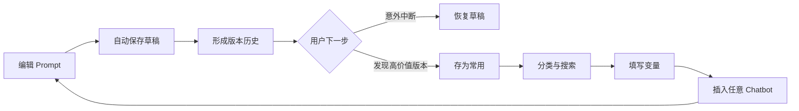
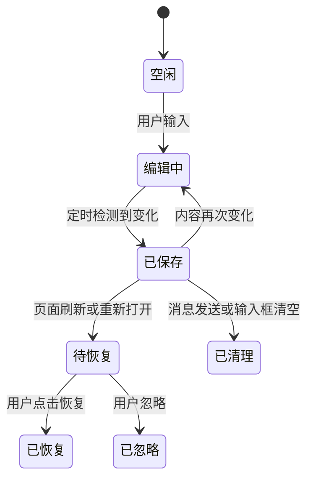

# Prompt Safeguard 产品案例

> 文档版本：V1.0 ｜ 对应产品版本：3.1.1 ｜ 更新日期：2026-08-12

## 一、项目概述

Prompt Safeguard 是一款面向重度 AI 对话用户的浏览器扩展。它将未发送 Prompt 的自动保存、历史版本和常用模板管理嵌入 Chatbot 输入区，降低长内容意外丢失的风险，并帮助用户把一次性输入沉淀为可复用资产。

这是一个从真实个人痛点出发完成的独立产品项目，覆盖需求识别、方案设计、交互设计、前端实现、跨站适配、测试与迭代。

## 二、问题定义

### 2.1 场景

用户在 ChatGPT、Gemini、豆包等网站编写较长 Prompt 时，内容通常只存在于当前页面的内存状态。刷新、误关页面、页面崩溃或站点重新渲染，都可能使未发送内容不可恢复。

长 Prompt 往往同时具有两个特征：

- **编辑成本高**：包含背景、约束、示例和输出格式，重写成本远高于一句简单问题；
- **复用价值高**：经过多轮修改后的 Prompt 往往会在相似任务中再次使用。

因此，真正的问题不只是“丢了一段文字”，而是用户缺少一个紧贴 AI 输入场景的 Prompt 生命周期工具。

### 2.2 痛点拆解

| 痛点 | 触发场景 | 用户损失 | 现有替代方案的不足 |
| --- | --- | --- | --- |
| 未发送内容丢失 | 刷新、误关、崩溃、页面重载 | 时间与思考成果损失 | 依赖用户主动复制，无法持续保护 |
| 修改过程不可追溯 | 多轮删改后想找回旧表述 | 无法比较或回滚 | 普通剪贴板没有对话上下文和版本 |
| Prompt 分散 | 聊天记录、备忘录、文档多处存放 | 查找和复用成本高 | 需要频繁切换工具和复制粘贴 |
| 模板复用机械 | 每次重复替换产品名、目标人群等 | 操作冗余且容易漏改 | 纯文本收藏不理解变量 |
| 跨站体验割裂 | 不同 Chatbot 输入框结构不同 | 工具只能绑定单一平台 | 单站脚本难以覆盖动态 DOM 改版 |

### 2.3 目标用户

- 高频使用生成式 AI 的产品经理、研究员、运营、咨询顾问和内容创作者；
- 经常编写多段背景、复杂约束或结构化输出要求的用户；
- 在多个 Chatbot 之间切换，但希望 Prompt 资产保持统一的用户。

### 2.4 核心用户故事

> 作为一名经常撰写长 Prompt 的用户，我希望输入内容能够自动保存，以便刷新或误关页面后快速恢复。

> 作为一名需要持续优化 Prompt 的用户，我希望查看并恢复历史版本，以便找回更好的旧表述。

> 作为一名跨多个 Chatbot 工作的用户，我希望在任意聊天网站调用同一套常用 Prompt，以便减少工具切换和重复编辑。

## 三、产品目标与边界

### 3.1 用户目标

1. 在不改变原有输入习惯的前提下自动保护未发送内容；
2. 在一次点击内恢复草稿或历史版本；
3. 将高价值版本转化为可搜索、可参数化的常用 Prompt；
4. 在主流 Chatbot 及其他网页聊天工具中获得一致体验。

### 3.2 产品目标

- 建立“输入 → 保存 → 恢复 → 沉淀 → 复用”的完整闭环；
- 以本地优先的架构降低隐私顾虑和开发复杂度；
- 通过分层适配机制降低新增网站和网站改版的维护成本。

### 3.3 非目标

- 当前版本不提供云端账号体系或团队协作；
- 不读取或管理已经发送的完整聊天记录；
- 不调用大模型改写 Prompt；
- 不承诺对所有网页编辑器零配置兼容。

## 四、方案设计

### 4.1 产品闭环

### 4.2 功能地图

| 模块 | 功能 | 设计意图 | 状态 |
| --- | --- | --- | --- |
| 草稿保护 | 5 秒自动保存、刷新恢复、发送后清理 | 低打扰地覆盖意外中断 | 已上线 |
| 版本历史 | 差异版本、最近 100 版、恢复任一版本 | 支持回滚且控制存储上限 | 已上线 |
| Prompt Vault | 新增、编辑、删除、搜索、文件夹 | 将一次性内容沉淀为资产 | 已上线 |
| 变量模板 | `{{变量名}}` 识别、填写、插入 | 降低重复替换成本 | 已上线 |
| 跨站适配 | 精确适配、通用评分、手动选框 | 在准确性和扩展性之间取平衡 | 已上线 |
| 数据管理 | 导入、导出、备份、迁移 | 提升可控性与长期留存 | 规划中 |

### 4.3 草稿状态设计

### 4.4 跨站适配策略

网站的输入框可能是 `textarea`、`contenteditable`、ProseMirror 或 Quill，且 DOM 会动态重建。单一 Selector 很容易在站点改版后失效，因此采用三层策略：

1. **精确适配**：为 ChatGPT、豆包、Gemini、Claude、DeepSeek维护站点规则和对话 ID；
2. **通用检测**：从所有可编辑元素中，根据可见性、尺寸、页面底部距离和语义属性评分；
3. **用户兜底**：允许手动点击输入框，并按站点记住稳定选择器。

这套设计避免了两个极端：只做单站导致扩展性差，或只做通用检测导致误识别率高。

## 五、关键产品决策

### 5.1 为什么是每 5 秒保存，而不是每次按键保存

- 每次按键写存储会产生大量冗余版本；
- 5 秒能覆盖大多数意外中断，同时减少写入频率；
- 仅在内容变化时创建版本，进一步避免重复数据。

后续可通过真实使用数据评估 3 秒、5 秒和 10 秒的恢复成功率与资源消耗。

### 5.2 为什么每个对话最多保存 100 个版本

- 版本历史的主要价值是恢复近期编辑，而不是永久归档；
- 固定上限让本地存储成本可预期；
- 重要版本可以单独存入 Prompt Vault，形成“短期历史 + 长期资产”的分层。

### 5.3 为什么 MVP 不做云同步

- Prompt 可能包含公司业务、研究材料或个人信息；
- 云同步会引入账号、服务端、加密、合规和数据删除机制；
- 本地优先更适合验证核心需求，也降低用户的首次信任成本。

未来若加入同步，应默认关闭，并提供端到端加密或用户自有存储选项。

### 5.4 为什么入口放在输入框上方

入口与草稿状态都属于“输入阶段”的任务。就近呈现可以让用户在不离开 Chatbot 的情况下确认保存状态、恢复版本和调用模板，同时避免长期占用页面侧边栏。

## 六、异常与边界

| 场景 | 当前策略 |
| --- | --- |
| 输入框尚未渲染 | 监听 DOM 变化并延迟重新扫描 |
| 页面存在多个编辑器 | 排除隐藏节点并对可见候选评分 |
| Chatbot 使用单页路由 | 根据实时 URL 更新对话作用域 |
| 网站改版导致规则失效 | 回退通用检测，并允许手动选框 |
| 输入内容为空 | 不保存空版本；编辑后清空则删除待恢复草稿 |
| 内容没有变化 | 不创建重复历史版本 |
| 用户已经发送 | 清除待恢复草稿，历史版本继续保留 |
| 扩展重新加载 | 旧标签页需刷新，避免失效的扩展上下文 |
| 本地存储读取失败 | 界面展示错误状态，不覆盖现有数据 |

## 七、非功能需求

### 7.1 隐私与安全

- 数据默认只保存在 `chrome.storage.local`；
- 不包含远程代码或第三方统计 SDK；
- 额外网站需要用户主动授权；
- 不采集聊天记录、账号身份或浏览历史。

### 7.2 性能

- 保存操作按固定周期触发，并在内容未变化时跳过写入；
- DOM 变化扫描使用帧级合并，避免同一批变更重复计算；
- 单对话历史最多 100 版，控制读取和渲染规模。

### 7.3 可维护性

- 站点差异集中在 `adapters.js`，业务逻辑不复制；
- 核心数据操作拆为纯函数，可在 Node.js 中直接测试；
- 精确适配失败后仍有通用检测和手动选框两级降级。

## 八、验收标准

| 编号 | 验收条件 | 验证方式 |
| --- | --- | --- |
| AC-01 | 输入非空内容后，5 秒内产生草稿记录 | 浏览器测试 |
| AC-02 | 内容未变化时不新增重复历史版本 | 单元测试 |
| AC-03 | 刷新后输入框为空时出现恢复入口 | 浏览器测试 |
| AC-04 | 恢复后输入框触发宿主网站的输入事件 | 浏览器测试 |
| AC-05 | 单个对话最多保留最近 100 个版本 | 单元测试 |
| AC-06 | 模板变量可提取、填写并替换 | 单元测试 |
| AC-07 | 五个内置站点能解析对应适配器和对话 ID | 适配器测试 |
| AC-08 | 同时存在隐藏和可见编辑器时选择可见编辑器 | 回归测试 |
| AC-09 | 所有 Prompt 数据不发送到外部服务器 | 代码审计 |

## 九、指标设计

当前是个人项目，尚未接入真实用户数据，因此不虚构增长或效率指标。若进入小范围测试，建议关注：

### 北极星指标

**每周成功恢复或复用 Prompt 的活跃用户数**：同时反映“避免损失”和“资产复用”两类价值。

### 核心指标

| 类型 | 指标 | 目的 |
| --- | --- | --- |
| 激活 | 安装后 24 小时内首次成功保存率 | 验证是否顺利进入核心体验 |
| 价值 | 草稿恢复次数 / 活跃用户 | 验证保险价值 |
| 留存 | Prompt Vault 周复用率 | 验证长期使用理由 |
| 兼容性 | 编辑器成功识别率 | 评估跨站泛化能力 |
| 质量 | 错误恢复率、误识别率 | 作为护栏指标 |
| 隐私 | 外部网络请求数 | 应保持为 0 |

出于隐私原则，若未来增加统计，应采用明确告知、默认关闭或只上传匿名聚合数据的方式。

## 十、版本演进

| 阶段 | 目标 | 主要能力 |
| --- | --- | --- |
| V1 | 验证草稿丢失问题 | ChatGPT 自动保存与恢复 |
| V2 | 从救急工具变成日常工具 | 状态入口、恢复提示与体验优化 |
| V3 | 建立 Prompt 生命周期 | 历史版本、Prompt Vault、变量与文件夹 |
| V3.1 | 提升跨站泛化 | 豆包/Gemini 等适配、候选评分、挂载兜底 |
| Next | 提升可控性与验证产品价值 | 导入导出、健康检查、可用性测试、指标体系 |

## 十一、复盘

### 做对的部分

- 从高痛感、可复现的个人问题切入，MVP 边界清晰；
- 将恢复功能自然扩展为 Prompt 资产管理，形成使用闭环；
- 在多站点适配中设计了降级路径，而非追求一次性覆盖所有网站；
- 选择本地优先架构，产品承诺与技术实现一致。

### 暴露的问题

- 早期实现与 ChatGPT DOM 耦合，泛化能力不足；
- 新增站点权限会影响旧版本升级体验，需要更严格的发布检查；
- 动态页面真实回归仍依赖人工，缺少持续集成环境中的端到端覆盖；
- 当前缺少真实用户访谈和量化数据，产品价值仍处于假设验证阶段。

### 下一步

1. 找 5–10 名高频 AI 用户做任务型可用性测试；
2. 记录安装、首次保存、恢复、模板复用和适配失败的匿名本地指标；
3. 优先实现导入导出，降低用户对本地数据不可迁移的顾虑；
4. 建立站点适配器契约测试和版本更新检查清单；
5. 根据验证结果决定是否投入可选同步，而不是直接建设账号体系。

## 十二、简历表述参考

**Prompt Safeguard｜独立产品设计与开发**

- 从长 Prompt 刷新丢失的真实痛点出发，独立完成浏览器扩展从需求定义、交互设计到开发测试的完整闭环；
- 设计“5 秒自动保存—版本恢复—常用模板—变量复用”的 Prompt 生命周期，单对话支持最近 100 个差异版本；
- 构建“站点精确适配 + 通用候选评分 + 手动选框”三层兼容策略，覆盖 ChatGPT、豆包、Gemini、Claude、DeepSeek；
- 采用本地优先架构，Prompt 数据仅保存在浏览器本机，并通过纯函数单测、适配器测试和 Manifest 回归测试保障质量。

> 使用前请按你的真实职责和验证结果调整表述，不建议加入未经验证的用户量、效率提升比例或留存数据。
